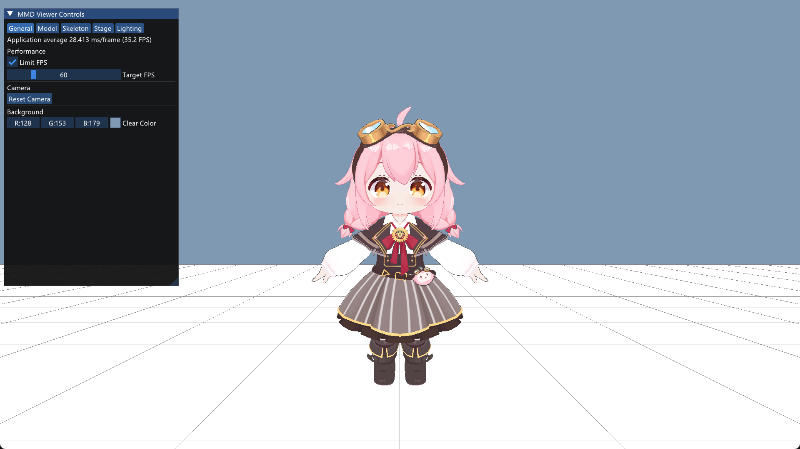
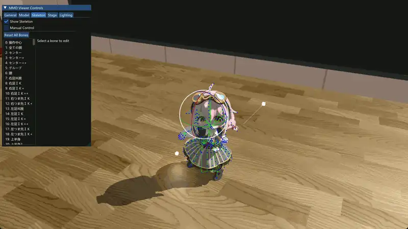

# MMDViewer

一个 MMD 模型与动作查看器，由计算机图形学课程期末大作业演化而来




## 功能

- **模型** — PMX 解析（顶点、纹理、材质、骨骼），基于 Toon Shader 的二次元渲染，描边效果
- **动画** — VMD 动作解析，FK / CCD-IK 骨骼系统，关键帧线性插值，骨骼可视化与手动控制
- **光照** — Blinn-Phong 多光源（平行光 + 点光源），PCF 软阴影
- **交互** — ImGui 控制面板，ImGuizmo 骨骼/灯光变换，轨道摄像机

## 编译

```bash
git clone https://github.com/taffy-nya/MMDViewer.git && cd MMDViewer
cmake --preset debug
cmake --build build
```

## 项目结构

```
src/
├── main.cpp                 # 入口
├── app/                     # 应用层
│   └── app.h / .cpp         #   主状态机、渲染循环
├── core/                    # 数据层
│   ├── model.h / model_loader.cpp   # PMX 数据结构 & 解析
│   ├── anim.h / anim_loader.cpp     # VMD 数据结构 & 解析
│   ├── camera.h / .cpp              # 轨道摄像机
│   ├── texture.h / .cpp             # OpenGL 纹理 RAII
│   ├── light.h                      # 光源结构
│   └── scene.h                      # 场景容器
├── animation/               # 动画层
│   ├── skeleton.h / .cpp            # 骨骼层级 FK
│   ├── ik_solver.h / .cpp           # CCD IK 求解
│   └── anim_player.h / .cpp         # 关键帧插值播放
├── render/                  # 渲染层
│   ├── shader.h / .cpp              # 着色器编译 (嵌入源码)
│   ├── model_renderer.h / .cpp      # 模型 VAO/VBO + 主绘制
│   ├── mesh_buffers.h / .cpp        # 顶点缓冲管理
│   ├── shadow_map.h / .cpp          # 阴影贴图
│   ├── stage.h / .cpp               # 舞台/地面
│   ├── skeleton_renderer.h / .cpp   # 骨骼可视化
│   └── gizmo_renderer.h / .cpp      # Gizmo 绘制
├── ui/                      # UI 层
│   ├── ui_renderer.h / .cpp         # ImGui 生命周期
│   └── panels/                      # 各控制面板
├── platform/                # 平台层
│   ├── window.h / .cpp              # GLFW 窗口
│   ├── file_dialog.h / .cpp         # 文件对话框
│   └── timer.h / .cpp               # 高精度时钟
└── shaders/                 # 着色器源码 (构建时嵌入)
    ├── embed.cmake                  # 嵌入脚本
    ├── shader_sources.h.in          # 嵌入模板
    └── *.glsl
```

## 技术栈

| 类别 | 库 |
|------|-----|
| 窗口 & OpenGL | GLFW 3.4 / GLAD 4.6 Core |
| 数学 | GLM 1.0.2 |
| UI | Dear ImGui 1.92.5 / ImGuizmo |
| 图片加载 | stb_image |
| 构建 | CMake 3.20+ / FetchContent |
| 语言标准 | C++23 |

## 已知问题

- [ ] 角色模型眼部的阴影计算异常
